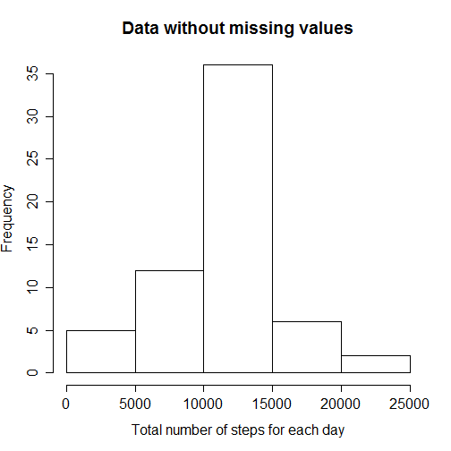

## Loading and preprocessing the data
The data for this assignment is available in the [course page ](https://class.coursera.org/repdata-033/human_grading/view/courses/975146/assessments/3/submissions) and is really straight forward. We have three variables (the descriptions below are taken directly from the course page):
- **Steps:** Number of steps taking in a 5-minute interval;
- **Date:** The date on which the measurement was taken in YYYY-MM-DD format;
- **Interval:** Identifier for the 5-minute interval in which measurement was taken.

First we do a little trick so that the weekdays are printed in English, and not in native system language:


```r
Sys.setlocale("LC_TIME", "English")
```

Next we do the rest of preparations: load libraries and set the working directory:

```r
library(plyr)
library(dplyr)
library(lubridate)
library(lattice)

# Adjust the path below to fit your choice of working directory.
path  <- "C:/Users/Leonardo/Documents/GitHub/RepData_PeerAssessment1"
setwd(path)
```

Finally we download the data, unzip it and read it to a data frame:


```r
fileUrl<-"https://d396qusza40orc.cloudfront.net/repdata%2Fdata%2Factivity.zip"
download.file(url=fileUrl,destfile = "./source.zip", mode='wb')
unzip(zipfile = "./source.zip", exdir = ".")
dt<-read.csv("activity.csv", stringsAsFactors = FALSE)
```

## What is mean total number of steps taken per day?

We begin by calculating the total number of steps taken per day. We make a date factor variable in order to group and summarise the dataset by it while creating a new variable: the sum of steps.


```r
dt2<-mutate(dt,datefact=factor(date))
dt3<-group_by(dt2,datefact)
dtdays<-summarise(dt3, sumsteps = sum(steps, na.rm = TRUE))

#Clear intermediate datasets
rm(dt2,dt3)

print(dtdays)
```

```
## Source: local data frame [61 x 2]
## 
##      datefact sumsteps
##        (fctr)    (int)
## 1  2012-10-01        0
## 2  2012-10-02      126
## 3  2012-10-03    11352
## 4  2012-10-04    12116
## 5  2012-10-05    13294
## 6  2012-10-06    15420
## 7  2012-10-07    11015
## 8  2012-10-08        0
## 9  2012-10-09    12811
## 10 2012-10-10     9900
## ..        ...      ...
```

Next we proceed our investigation by doing a histogram of the total of steps taken per day and save it to a *png* file.


```r
hist(dtdays$sumsteps,
     xlab="Total number of steps for each day",
     main="")
```

 


```r
#Save it to a png file
dev.copy(png, 
         file   = "plot1.png",
         width  = 640,
         height = 480)
dev.off()
```

Finally we calculate the mean and median of the total number of steps taken per day.


```r
stepsmean<-mean(dtdays$sumsteps, na.rm = TRUE)
print(stepsmean)
```

```
## [1] 9354.23
```

```r
stepsmed<-median(dtdays$sumsteps, na.rm = TRUE)
print(stepsmed)
```

```
## [1] 10395
```

## What is the average daily activity pattern?

We begin the analysis by making a time series plot of the 5-minute interval and the average number of steps taken, averaged across all days. The steps are very similar with the ones we took in the previous exercise.


```r
dt2<-mutate(dt,interfact=factor(interval))
dt3<-group_by(dt2,interfact)
dt4<-summarise(dt3, meansteps = mean(steps, na.rm = TRUE))
dtintervals<-mutate(dt4,interval=as.character(interfact))

plot(dtintervals$interval,dtintervals$meansteps,
     type="l",
     xlab="Interval",
     ylab="Average number of steps")
```

 


```r
#Save it to a png file
dev.copy(png, 
         file   = "plot2.png",
         width  = 800,
         height = 600)
dev.off()

#Clear intermediate datasets
rm(dt2,dt3,dt4)
```

 

Next we look for which 5-minute interval, on average across all the days in the dataset, contains the maximum number of steps.


```r
maxinter<-dtintervals[which.max(dtintervals$meansteps),3]
print(maxinter)
```

```
## Source: local data frame [1 x 1]
## 
##   interval
##      (chr)
## 1      835
```

## Imputing missing values

Now we're insterested in taking care of the missing values in the dataset. We begin by calculating the total number of missing values.


```r
sum(is.na(dt$steps))
```

```
## [1] 2304
```

In order to get rid of the missing values we will substitute them with the mean of the correponding interval.

First we create the data set with the means for each interval.


```r
dt2<-mutate(dt,interfact=factor(interval))
dt3<-group_by(dt2,interfact)
dt4<-summarise(dt3, meansteps = mean(steps, na.rm = TRUE))
dt4<-mutate(dt4,interval=as.numeric(as.character(interfact)))
dtmeans<-select(dt4,meansteps,interval)

head(dtmeans)
```

```
## Source: local data frame [6 x 2]
## 
##   meansteps interval
##       (dbl)    (dbl)
## 1 1.7169811        0
## 2 0.3396226        5
## 3 0.1320755       10
## 4 0.1509434       15
## 5 0.0754717       20
## 6 2.0943396       25
```

Next we merge it with the original data set and do the substitution.


```r
newdt<-join(dt,dt4)
```

```
## Joining by: interval
```

```r
newdt2<-mutate(newdt,newsteps=ifelse(is.na(newdt$steps),
                                     newdt$meansteps,
                                     newdt$steps))
newdt2<-select(newdt2,date,interval,newsteps)
newdt<-rename(newdt2,steps = newsteps)

head(newdt)
```

```
##         date interval     steps
## 1 2012-10-01        0 1.7169811
## 2 2012-10-01        5 0.3396226
## 3 2012-10-01       10 0.1320755
## 4 2012-10-01       15 0.1509434
## 5 2012-10-01       20 0.0754717
## 6 2012-10-01       25 2.0943396
```

```r
#Clear intermediate datasets
rm(dt2,dt3,dt4,newdt2)
```

Now we will evaluate how the missing values substitution affected the informations we looked before.

First we plot the new histogram of the total number of steps taken each day:


```r
dt2<-mutate(newdt,datefact=factor(date))
dt3<-group_by(dt2,datefact)
newdtdays<-summarise(dt3, sumsteps = sum(steps, na.rm = TRUE))

#Clear intermediate datasets
rm(dt2,dt3)

hist(newdtdays$sumsteps,
     xlab="Total number of steps for each day",
     main="Data without missing values")
```

 


```r
#Save it to a png file
dev.copy(png, 
         file   = "plot3.png",
         width  = 800,
         height = 600)
dev.off()
```

Second we calculate the mean and median total number of steps taken per day:


```r
newstepsmean<-mean(newdtdays$sumsteps, na.rm = TRUE)
print(newstepsmean)
```

```
## [1] 10766.19
```

```r
newstepsmed<-median(newdtdays$sumsteps, na.rm = TRUE)
print(newstepsmed)
```

```
## [1] 10766.19
```

Finally we look for the maximum difference of steps taken per day (original dataset x *new* dataset)


```r
newdtdays2<-rename(newdtdays,newsumsteps=sumsteps)
measuredt<-join(dtdays,newdtdays2)
```

```
## Joining by: datefact
```

```r
#Clear intermediate dataset
rm(newdtdays2)

measuredt<-mutate(measuredt,
                  absdiff = abs(newsumsteps-sumsteps),
                  date = as.character(datefact))

print(measuredt[which.max(measuredt$absdiff),5])
```

```
## [1] "2012-10-01"
```

```r
print(max(measuredt$absdiff))
```

```
## [1] 10766.19
```

## Are there differences in activity patterns between weekdays and weekends?

We will beggin addressing the question by creating a factor variable that says if the date is a weekday or a weekend day.


```r
#Create a new variable in proper date format using the ymd function (lubridate)
newdt2<-mutate(newdt,date2=ymd(date))
#Get the weekday of it with the weekdays function
newdt2<-mutate(newdt2,weekday=weekdays(date2, abbreviate = TRUE))
#Create the flag variable
newdt2<-mutate(newdt2,dayflag=as.factor(ifelse(weekday=='Sat'|weekday=='Sun',
                                        'weekend',
                                        'weekday')))
head(newdt2)
```

```
##         date interval     steps      date2 weekday dayflag
## 1 2012-10-01        0 1.7169811 2012-10-01     Mon weekday
## 2 2012-10-01        5 0.3396226 2012-10-01     Mon weekday
## 3 2012-10-01       10 0.1320755 2012-10-01     Mon weekday
## 4 2012-10-01       15 0.1509434 2012-10-01     Mon weekday
## 5 2012-10-01       20 0.0754717 2012-10-01     Mon weekday
## 6 2012-10-01       25 2.0943396 2012-10-01     Mon weekday
```

We make a panel plot containing a time series plot of the 5-minute interval and the average number of steps taken, averaged across all weekday days or weekend days (y-axis).


```r
newdt2<-mutate(newdt2,interval=as.factor(interval))
newdt3<-group_by(newdt2,interval,dayflag)
newdt3<-summarise(newdt3, meansteps = mean(steps, na.rm = TRUE))
newdt3<-mutate(newdt3, interval2 = as.numeric(as.character(interval)))

xyplot(meansteps ~ interval2 | dayflag, 
       data = newdt3, 
       layout = c(1, 2), 
       type = "l",
       main = "Data without missing values - 
       Weekdays x Weekends avarage number of steps",
       xlab = "Interval",
       ylab = "Average number of steps")
```

 


```r
#Save it to a png file
dev.copy(png, 
         file   = "plot4.png",
         width  = 1280,
         height = 720)
dev.off()
```

We observe that there really are differences in patterns between weekdays and weekends: on weekends we observe more peaks in activity, and they occur over more periods of time.
